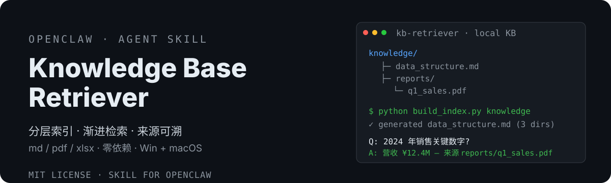

# OpenClaw Knowledge Base Retriever 📚

<div align="center">
  <strong>🇨🇳 中文</strong> | <a href="README.en.md">🌐 English</a>
</div>

<p align="center">
  
</p>

> 本地知识库检索器——分层索引导航 + 渐进式检索，核心检索零依赖零 API key，Windows / macOS 双平台（PDF/Excel 处理按需安装 Python 包）。
> OpenClaw local knowledge-base retriever — hierarchical index navigation + progressive retrieval over a local directory (md/pdf/xlsx), core retrieval zero-dependency (PDF/Excel need on-demand pip packages).


[](https://clawhub.ai/dtsola/skills/xiaoyaoclaw-kb-retriever)

## 为什么需要它

OpenClaw agent 面对本地知识库（文档/报表/资料目录）时，常见问题：
- ❌ **整文件硬读**：大 PDF/Excel 一次全塞进上下文，token 爆炸
- ❌ **盲目搜索**：没有索引导航，全目录扫描又慢又乱
- ❌ **乱处理格式**：PDF/Excel 用错工具，提取出一堆垃圾
- ❌ **依赖云端**：RAG 方案要 embedding 模型或外部 API key，隐私不保

这个 skill 一次性解决：**分层索引导航 + 渐进式检索 + 先学后处理 + 全本地零 API key**。

## 特性

- 🗂️ **分层索引导航**：每层目录一个 `data_structure.md`，顺着索引树往下钻，不整树扫描
- 🔍 **渐进式检索**：grep/Select-String 定位 → 窗口读（offset/limit）→ 最多 5 轮迭代，永不全文件加载
- 📖 **先学后处理**：遇到 PDF/Excel 强制先读 references 教程再动手，杜绝瞎处理
- 🐍 **双平台统一**：PDF 走 Python（pdfplumber），Windows / macOS 行为完全一致
- 🔒 **全本地零 API key**：不建向量索引、不调云端 API，敏感资料不出本机（PDF/Excel 仅按需安装白名单 Python 包）
- 🏗️ **一键建库**：`python build_index.py <知识库>` 自动生成索引骨架，上手零门槛
- 🧭 **来源可溯**：答案带文件 + 位置引用，可验证不臆造

## 安装

```bash
# ClawHub（推荐）
clawhub install xiaoyaoclaw-kb-retriever

# 或从 GitHub 手动安装
git clone https://github.com/dtsola/xiaoyaoclaw-kb-retriever
# 把 SKILL.md、references/、scripts/ 放到你的 skills 目录
```

## 使用

1. 把 skill 放到 OpenClaw 的 skills 目录
2. 准备知识库：把资料放进工作区的 `knowledge/` 目录（或对话中指定任意路径）
3. 一键生成索引（可选但推荐）：

```bash
python scripts/build_index.py knowledge
```

4. 对 agent 说「**从知识库查 xxx**」，agent 会自动：定位知识库 → 分层索引导航 → 渐进式检索 → 带来源回答

## 🚀 快速上手（三步，5 分钟）

### Step 1：安装技能

```bash
clawhub install xiaoyaoclaw-kb-retriever
```

装完它就在你的 agent 技能列表里了，不用配置任何 API key 或服务。

### Step 2：放资料 + 建索引

把文档放进工作区的 `knowledge/` 目录（没有就建一个），md / pdf / xlsx 都行：

```
你的工作区/
└── knowledge/          ← 资料都放这
    ├── 产品文档/
    ├── 销售报表/
    └── 会议纪要/
```

然后跑一条命令生成「目录地图」（索引，可选但推荐）：

```bash
python scripts/build_index.py knowledge
```

> 不跑也能用，但跑了之后 agent 找东西快得多、准得多。

### Step 3：直接用大白话问

不用记任何命令，像聊天一样问：

> 「知识库里 2024 年销售报表的关键数字是多少？」
> 「从知识库查一下我们产品的定价策略」

agent 自动完成：**看目录地图 → 找到相关文件 → 只读需要的部分 → 带来源回答你**。

### 日常使用习惯

| 场景 | 动作 |
|---|---|
| 首次建库 | `python build_index.py knowledge` 一键生成索引 |
| 新增资料 | 重跑 build_index（已有索引自动跳过，--force 重建） |
| 指定目录 | 对话中说「用 ./docs 作为知识库」 |
| 大 PDF | 自动按页范围提取（extract_pdf_text.py），不整文件读 |
## 与其他方案的区别

| | 向量 RAG 方案（qmd / boof / hk101） | **xiaoyaoclaw-kb-retriever** |
|---|---|---|
| 依赖 | embedding 模型 / 云端 API key / 本地 ML | ✅ 无云服务（grep + read + pdfplumber + pandas，按需装包） |
| 索引 | 需建向量索引 | ✅ 轻量 data_structure.md 文本索引，一键生成 |
| 隐私 | 部分方案上传云端 | ✅ 全本地，不出本机 |
| 平台 | 多为 Unix 向 | ✅ Windows / macOS 双平台一等公民 |
| 语言 | 英文为主 | ✅ 中英双语 |
| 上下文开销 | 需加载索引/向量 | ✅ 渐进式检索，只读匹配窗口 |

## 目录结构

```
xiaoyaoclaw-kb-retriever/
├── SKILL.md                    # 技能主体（OpenClaw 适配版）
├── manifest.json               # 兼容 openclaw / claude-code / cursor 等
├── references/
│   ├── pdf_reading.md          # PDF 处理（Python 统一路线）
│   ├── excel_reading.md        # Excel 读取
│   └── excel_analysis.md       # Excel 分析
├── scripts/
│   ├── build_index.py          # 【亮点】一键生成 data_structure.md 索引
│   └── extract_pdf_text.py     # 双平台 PDF 文本提取
├── templates/
│   └── data_structure.md       # 索引模板
├── docs/
│   └── DESIGN.md               # 设计方案
├── README.md / README.en.md
└── LICENSE
```

## 上游致谢

本项目基于 [ConardLi/garden-skills](https://github.com/ConardLi/garden-skills) 的 kb-retriever（MIT）fork 改造：
- **保留**：分层索引导航、先学后处理、渐进式检索、来源溯源
- **改造**：OpenClaw 工具适配（read / exec 双平台命令）、PDF 处理 Python 统一路线、一键建库脚本、中英双语

## License

MIT — 随便用，署名可选。

---

## 🛠️ 需要定制？

**Agent & Skills 定制，价格 ¥800 起。**

- 微信：`dtsola`（添加好友时备注：**openclaw定制**）
- 服务范围：OpenClaw 多 agent 部署 / 工作区规范化 / 自定义 Skill 开发 / agent 记忆系统搭建 / 知识库搭建

## 姊妹项目

- 🏠 **xiaoyaoclaw-workspace-initializer**（工作区初始化器）：给每个 agent 一个「家」——标准目录结构 + WORKSPACE.md 规范 + 多 agent 配置安全。<https://github.com/dtsola/xiaoyaoclaw-workspace-initializer>
- 🧠 **xiaoyaoclaw-memory-distill**（记忆蒸馏）：把对话蒸馏成 MEMORY.md + 日常日志，解决上下文溢出。<https://github.com/dtsola/xiaoyaoclaw-memory-distill>
- 🗂️ **xiaoyaoclaw-task-progress-tracker**（任务进度跟踪器）：目录即容器，PROGRESS.md 即进度——tasks/ 与 projects/ 生命周期管理。<https://github.com/dtsola/xiaoyaoclaw-task-progress-tracker>
- 🩹 **xiaoyaoclaw-workspace-auditor**：工作区体检（只读审计），5 类检查 + 分级报告 + 修复建议，零依赖脚本永不改文件。<https://github.com/dtsola/xiaoyaoclaw-workspace-auditor>
- 📎 **xiaoyaoclaw-web-clipper**（网页剪藏）：把任意网页保存为带 frontmatter 的本地 Markdown——双引擎正文提取（readability + trafilatura 降级链）、中文文件名安全、批量剪藏 + 去重；输出直通 knowledge/clippings/，配合 kb-retriever 建索引即可检索。<https://github.com/dtsola/xiaoyaoclaw-web-clipper>
- 🤝 **xiaoyaoclaw-agent-orchestrator**（Agent 协作编排，**协作层**）：架在六件套之上——拆任务、分 agent、管进度、聚结果、失败重试。<https://github.com/dtsola/xiaoyaoclaw-agent-orchestrator>

## 